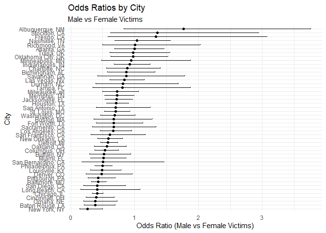
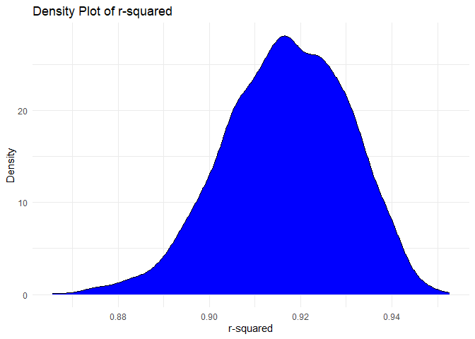
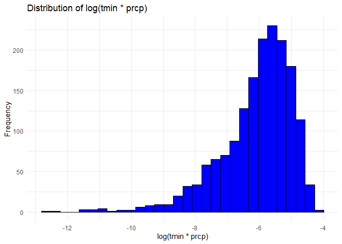
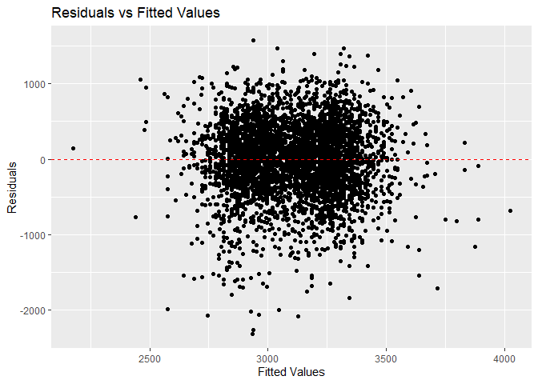
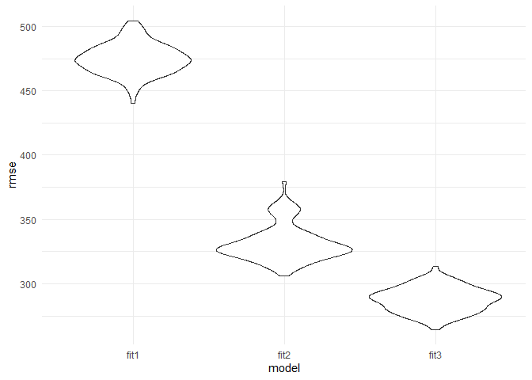

p8105_hw6_zq2227
================
Zixuan Qiu
2023-12-01

``` r
library(tidyverse)
library(readr)
library(broom)
library(modelr)

set.seed(1)
```

# Problem 1

``` r
url= "https://raw.githubusercontent.com/washingtonpost/data-homicides/master/homicide-data.csv"

homicide_data =read.csv(url)
str(homicide_data)
```

    ## 'data.frame':    52179 obs. of  12 variables:
    ##  $ uid          : chr  "Alb-000001" "Alb-000002" "Alb-000003" "Alb-000004" ...
    ##  $ reported_date: int  20100504 20100216 20100601 20100101 20100102 20100126 20100127 20100127 20100130 20100210 ...
    ##  $ victim_last  : chr  "GARCIA" "MONTOYA" "SATTERFIELD" "MENDIOLA" ...
    ##  $ victim_first : chr  "JUAN" "CAMERON" "VIVIANA" "CARLOS" ...
    ##  $ victim_race  : chr  "Hispanic" "Hispanic" "White" "Hispanic" ...
    ##  $ victim_age   : chr  "78" "17" "15" "32" ...
    ##  $ victim_sex   : chr  "Male" "Male" "Female" "Male" ...
    ##  $ city         : chr  "Albuquerque" "Albuquerque" "Albuquerque" "Albuquerque" ...
    ##  $ state        : chr  "NM" "NM" "NM" "NM" ...
    ##  $ lat          : num  35.1 35.1 35.1 35.1 35.1 ...
    ##  $ lon          : num  -107 -107 -107 -107 -107 ...
    ##  $ disposition  : chr  "Closed without arrest" "Closed by arrest" "Closed without arrest" "Closed by arrest" ...

``` r
homicide_data=homicide_data|>
  mutate(city_state = paste(city,state, sep = ", "))|>
  mutate(solved=ifelse(disposition== "Closed by arrest",1,0))
  
omit_cities = c("Dallas, TX", "Phoenix, AZ", "Kansas City, MO", "Tulsa, AL")

homicide_data=homicide_data|>
  filter(!city_state %in% omit_cities)|>
  filter(victim_race %in%c("White", "Black"))|>
  mutate(victim_age=as.numeric(victim_age))
```

    ## Warning: There was 1 warning in `mutate()`.
    ## ℹ In argument: `victim_age = as.numeric(victim_age)`.
    ## Caused by warning:
    ## ! NAs introduced by coercion

``` r
baltimore= homicide_data|>
  filter(city_state == "Baltimore, MD")
```

**glm baltimore**

``` r
glmbaltimore= glm(solved ~ victim_age + victim_race + victim_sex, data = baltimore, family = binomial()) 

glmtidy=tidy(glmbaltimore)
glmtidy
```

    ## # A tibble: 4 × 5
    ##   term             estimate std.error statistic  p.value
    ##   <chr>               <dbl>     <dbl>     <dbl>    <dbl>
    ## 1 (Intercept)       0.310     0.171        1.81 7.04e- 2
    ## 2 victim_age       -0.00673   0.00332     -2.02 4.30e- 2
    ## 3 victim_raceWhite  0.842     0.175        4.82 1.45e- 6
    ## 4 victim_sexMale   -0.854     0.138       -6.18 6.26e-10

**odds ratio for solving homicides comparing male victims to female
victims**

``` r
oddratio= glmtidy|>
  filter(term == "victim_sexMale")|>
  mutate(OR = exp(estimate),
         LowerCI = exp(estimate - 1.96 * std.error),
         UpperCI = exp(estimate + 1.96 * std.error))

oddratio
```

    ## # A tibble: 1 × 8
    ##   term           estimate std.error statistic  p.value    OR LowerCI UpperCI
    ##   <chr>             <dbl>     <dbl>     <dbl>    <dbl> <dbl>   <dbl>   <dbl>
    ## 1 victim_sexMale   -0.854     0.138     -6.18 6.26e-10 0.426   0.325   0.558

**glm for each of the cities**

``` r
#creat function 
glmfunction = function(df) {
  glm_model = glm(solved ~ victim_age + victim_sex + victim_race, data = df, family = binomial())
  tidy(glm_model)
}

cityglm= homicide_data|>
  group_by(city_state)|>
  nest()|>
  mutate(model=map(data,glmfunction))|>
  select(city_state,model)|>
  unnest(model)
```

**odd ratio of each city**

``` r
odds_ratio_city = cityglm|>
  filter(term == "victim_sexMale") |>
  mutate(OR = exp(estimate),
         LowerCI = exp(estimate - 1.96 * std.error),
         UpperCI = exp(estimate + 1.96 * std.error))|>
  select(city_state, OR, LowerCI, UpperCI)

odds_ratio_city
```

    ## # A tibble: 47 × 4
    ## # Groups:   city_state [47]
    ##    city_state         OR LowerCI UpperCI
    ##    <chr>           <dbl>   <dbl>   <dbl>
    ##  1 Albuquerque, NM 1.77    0.831   3.76 
    ##  2 Atlanta, GA     1.00    0.684   1.46 
    ##  3 Baltimore, MD   0.426   0.325   0.558
    ##  4 Baton Rouge, LA 0.381   0.209   0.695
    ##  5 Birmingham, AL  0.870   0.574   1.32 
    ##  6 Boston, MA      0.674   0.356   1.28 
    ##  7 Buffalo, NY     0.521   0.290   0.935
    ##  8 Charlotte, NC   0.884   0.557   1.40 
    ##  9 Chicago, IL     0.410   0.336   0.501
    ## 10 Cincinnati, OH  0.400   0.236   0.677
    ## # ℹ 37 more rows

**plot:estimated ORs and CIs for each city**

``` r
ggplot(odds_ratio_city,aes(x=reorder(city_state,OR),y=OR))+
  geom_point()+
  geom_errorbar(aes(ymin = LowerCI, ymax = UpperCI), width = 0.2)+
  coord_flip()+
  labs(title = "Odds Ratios by City",
       subtitle = "Male vs Female Victims",
       x = "City",
       y = "Odds Ratio (Male vs Female Victims)") +
  theme_minimal() 
```

<!-- -->
**comment :The plot presents the odds ratios for solving homicides in
various cities, comparing male to female victims, city such as
Albuquerque and Stockton has a significant larger odds ratios greater
than 1 means that homicide cases of male victims are more likely to be
solved compared to female victims.Cities likes New York and Baltimore
has a small odds ratios below 1 indicate that a higher solved proportion
of female victims compared to male victims. The width of the confidence
intervals indicate the precise estimates of the odds ratio.**

# Problem 2

``` r
#download the central park data
weather_df = 
  rnoaa::meteo_pull_monitors(
    c("USW00094728"),
    var = c("PRCP", "TMIN", "TMAX"), 
    date_min = "2022-01-01",
    date_max = "2022-12-31") |>
  mutate(
    name = recode(id, USW00094728 = "CentralPark_NY"),
    tmin = tmin / 10,
    tmax = tmax / 10) |>
  select(name, id, everything())
```

    ## using cached file: C:\Users\zixuan qiu\AppData\Local/R/cache/R/rnoaa/noaa_ghcnd/USW00094728.dly

    ## date created (size, mb): 2023-09-28 09:58:37.001566 (8.541)

    ## file min/max dates: 1869-01-01 / 2023-09-30

**ues modelr::boostrap function to draw bootstrap samples**

``` r
initial_model = lm(tmax ~ tmin + prcp, data = weather_df)

tidy(initial_model)
```

    ## # A tibble: 3 × 5
    ##   term        estimate std.error statistic   p.value
    ##   <chr>          <dbl>     <dbl>     <dbl>     <dbl>
    ## 1 (Intercept)  8.04      0.230      35.0   4.39e-118
    ## 2 tmin         1.01      0.0162     62.7   1.43e-196
    ## 3 prcp        -0.00154   0.00210    -0.733 4.64e-  1

``` r
bootstrap_results =weather_df |> 
  modelr::bootstrap(n = 5000) |> 
  mutate(
    models = map(strap, ~ lm(tmax ~ tmin + prcp, data = .) ),
    results = map(models, broom::glance))|>
  unnest(results)
```

``` r
r_squared =bootstrap_results |>
  select(.id,r.squared)


quantiles_r_squared = quantile(r_squared$r.squared, probs = c(0.025, 0.975))
quantiles_r_squared #2.5% and 97.5% quantiles to provide a 95% confidence interval for r^2
```

    ##      2.5%     97.5% 
    ## 0.8885495 0.9406812

**R_squared distribution plot**

``` r
ggplot(r_squared, aes(x = r.squared)) + 
  geom_density(fill = "blue") + 
  theme_minimal() + 
  labs(title = "Density Plot of r-squared", 
       x = "r-squared", 
       y = "Density")
```

<!-- -->
**Describe:the 2.5% quantile is approximately 0.888, and the 97.5%
quantile is approximately 0.9409, the narrow CI indicate the high
precision in the estimate.The plot’s shape indicates that the
distribution of r^2 is concentrated close to 0.91 that is a high value,
suggesting that the model has a good fit in most of the bootstrap
samples, the outputs demonstrate a strong linear relationship captured
by the regression model across the bootstrap samples.**

**log(tmin \* prcp)**

``` r
logresult=weather_df |> 
  modelr::bootstrap(n = 5000) |> 
  mutate(
    models = map(strap, ~ lm(tmax ~ tmin + prcp, data = .) ),
    log_result=map(models,broom::tidy))|>
  unnest(log_result)
```

``` r
logclean = logresult|>
  select(.id,term,estimate)|>
  pivot_wider(
    names_from = "term",
    values_from = "estimate"
  )|>
  mutate(log_product = log(tmin * prcp))|>
  na.omit()
```

    ## Warning: There was 1 warning in `mutate()`.
    ## ℹ In argument: `log_product = log(tmin * prcp)`.
    ## Caused by warning in `log()`:
    ## ! NaNs produced

``` r
quantiles_log = quantile(logclean$log_product, probs = c(0.025, 0.975))
quantiles_log
```

    ##      2.5%     97.5% 
    ## -8.884759 -4.603985

**log(tmin \* prcp) distribution plot**

``` r
ggplot(logclean, aes(x =log_product )) + 
  geom_histogram( fill = "blue", color = "black") + 
  theme_minimal() + 
  labs(title = "Distribution of log(tmin * prcp)", 
       x = "log(tmin * prcp)", 
       y = "Frequency")
```

    ## `stat_bin()` using `bins = 30`. Pick better value with `binwidth`.

<!-- -->
**Describe: The 95 CI of the log(tmin \* prcp) is -8.884759 -4.603985.
The distribution of the value is left-skewed and have a long left tail.
THe mean value is smaller than median. The distribution of the values
does not trend to normal distribution.**

# Problem 3

``` r
birthweight= read.csv("./Data/birthweight.csv")

birthweight=birthweight|>
  mutate(babysex=as.factor(babysex))|>
  mutate(malform=as.factor(malform))|>
  mutate(frace=as.factor(frace))|>
  mutate(mrace=as.factor(mrace))|>
  select(-pnumlbw, -pnumsga) 
```

### Assume bwt as an outcome that may depend on wtgain( mother’s weight gain during pregnancy) and mrace(mother’s race) , fit that initial model.

``` r
fit1 = lm(bwt ~ wtgain+mrace , data = birthweight)

tidy(fit1)
```

    ## # A tibble: 5 × 5
    ##   term        estimate std.error statistic  p.value
    ##   <chr>          <dbl>     <dbl>     <dbl>    <dbl>
    ## 1 (Intercept)   3013.     17.8      169.   0       
    ## 2 wtgain          11.4     0.656     17.3  5.23e-65
    ## 3 mrace2        -313.     14.9      -21.1  9.32e-94
    ## 4 mrace3        -116.     72.8       -1.59 1.12e- 1
    ## 5 mrace4        -194.     32.0       -6.05 1.58e- 9

``` r
birthweight=birthweight|>
  add_predictions(fit1, var = "fitted_values")|>
  add_residuals(fit1, var = "residuals")
```

``` r
ggplot(birthweight, aes(x = fitted_values, y = residuals)) +
  geom_point() +
  geom_hline(yintercept = 0, linetype = "dashed", color = "red") +
  labs(title = "Residuals vs Fitted Values",
       x = "Fitted Values",
       y = "Residuals")
```

<!-- -->
**comment:**

### One using length at birth and gestational age as predictors (main effects only)

``` r
fit2 =lm(bwt ~ blength+gaweeks, data = birthweight)
tidy(fit2)
```

    ## # A tibble: 3 × 5
    ##   term        estimate std.error statistic  p.value
    ##   <chr>          <dbl>     <dbl>     <dbl>    <dbl>
    ## 1 (Intercept)  -4348.      98.0      -44.4 0       
    ## 2 blength        129.       1.99      64.6 0       
    ## 3 gaweeks         27.0      1.72      15.7 2.36e-54

### One using head circumference, length, sex, and all interactions (including the three-way interaction) between these

``` r
fit3 = lm(bwt ~ bhead * blength * babysex, data = birthweight)
tidy(fit3)
```

    ## # A tibble: 8 × 5
    ##   term                    estimate std.error statistic      p.value
    ##   <chr>                      <dbl>     <dbl>     <dbl>        <dbl>
    ## 1 (Intercept)            -7177.     1265.       -5.67  0.0000000149
    ## 2 bhead                    182.       38.1       4.78  0.00000184  
    ## 3 blength                  102.       26.2       3.90  0.0000992   
    ## 4 babysex2                6375.     1678.        3.80  0.000147    
    ## 5 bhead:blength             -0.554     0.780    -0.710 0.478       
    ## 6 bhead:babysex2          -198.       51.1      -3.88  0.000105    
    ## 7 blength:babysex2        -124.       35.1      -3.52  0.000429    
    ## 8 bhead:blength:babysex2     3.88      1.06      3.67  0.000245

### crossv_mc compare

``` r
cv_df =
  crossv_mc(birthweight, 100) |> 
  mutate(
    train = map(train, as_tibble),
    test = map(test, as_tibble))
```

``` r
cv_df = 
  cv_df |> 
  mutate(
    fit1  = map(train, \(df)  lm(bwt ~ wtgain+mrace , data = df)),
    fit2     = map(train, \(df) lm(bwt ~ blength+gaweeks, data = df)),
    fit3  = map(train, \(df) lm(bwt ~ bhead * blength * babysex, data = df))) |> 
  mutate(
    rmse_fit1 = map2_dbl(fit1, test, \(mod, df) rmse(model = mod, data = df)),
    rmse_fit2 = map2_dbl(fit2, test, \(mod, df) rmse(model = mod, data = df)),
    rmse_fit3 = map2_dbl(fit3, test, \(mod, df) rmse(model = mod, data = df)))
```

``` r
cv_df |> 
  select(starts_with("rmse")) |> 
  pivot_longer(
    everything(),
    names_to = "model", 
    values_to = "rmse",
    names_prefix = "rmse_") |> 
  mutate(model = fct_inorder(model)) |> 
  ggplot(aes(x = model, y = rmse)) + geom_violin()+theme_minimal() 
```

<!-- -->
